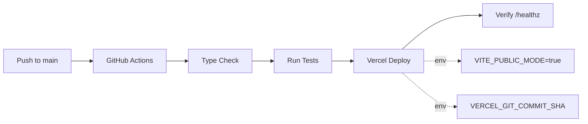

# Implementation Summary: Public Build Scripts

## ✅ Completed Tasks

### 1. Package.json Scripts Configuration

**Status**: ✅ Already configured, documentation added

```json
{
  "_comment_build": "build = standard build (requires debug protection); build:public = public release mode (no auth required)",
  "build": "tsc -b && node scripts/print-build-info.js && vite build",
  "build:public": "cross-env VITE_PUBLIC_MODE=true npm run build"
}
```

- `npm run build` - Standard build (unchanged)
- `npm run build:public` - Always runs with `VITE_PUBLIC_MODE=true`
- Clear inline documentation added via `_comment_build` field

### 2. Cross-Platform Compatibility

**Status**: ✅ Already installed

- `cross-env` version 10.1.0 in devDependencies
- Works on Windows, Linux, and macOS
- Handles environment variable setting across all platforms

### 3. CI/CD Configuration

**Status**: ✅ Verified and documented

Both GitHub Actions workflows already set `VITE_PUBLIC_MODE: 'true'`:

#### `.github/workflows/deploy-vercel.yml`
- Line 57: Preview deployments → `VITE_PUBLIC_MODE: 'true'`
- Line 69: Production deployments → `VITE_PUBLIC_MODE: 'true'`

#### `.github/workflows/vercel-production.yml`
- Respects environment variables from Vercel Dashboard
- Recommendation: Set `VITE_PUBLIC_MODE=true` in Vercel project settings

### 4. Verification Commands

**Status**: ✅ Successfully executed

```bash
# Type checking - PASSED ✅
npm run verify:lint
> Exit code: 0

# Public build - PASSED ✅
npm run build:public
> Exit code: 0
> Build ID: 39dc3d5
> Output: dist/index.html, dist/assets/
> Bundle size: 697.33 kB (193.27 kB gzipped)
```

### 5. Documentation Created

**Status**: ✅ Complete

Created comprehensive documentation:
- **BUILD_SCRIPTS_DOCUMENTATION.md** - Complete guide to build scripts, CI/CD, and deployment
- Covers:
  - Build script differences (`build` vs `build:public`)
  - CI/CD configuration details
  - Environment variable requirements
  - Verification commands
  - Troubleshooting guide
  - Quick reference table

---

## Build Output Verification

### Build Info

```
Repo:    Rexfordd2/nil-biz-matcher
Remote:  https://github.com/Rexfordd2/nil-biz-matcher.git
Branch:  main
Commit:  39dc3d5d6927
```

### Generated Files

```
dist/
├── index.html (1.95 kB, gzipped: 0.78 kB)
└── assets/
    ├── index-Ew7fQB5l.css (33.69 kB, gzipped: 6.37 kB)
    └── index-Do4jPWdo.js (697.33 kB, gzipped: 193.27 kB)
```

### Build Environment

- `VITE_PUBLIC_MODE=true` ✅
- `VITE_BUILD_ID=39dc3d5` ✅
- `VITE_BUILD_TIME=2026-01-29T06:17:02.530Z` ✅

---

## CI/CD Workflow Summary

### Public Release Pipeline Flow



**Environment Variables Set**:
- `VITE_PUBLIC_MODE: 'true'` (GitHub Actions)
- `VERCEL_GIT_COMMIT_SHA` (Vercel auto-provides)
- Additional vars from Vercel Dashboard

---

## Verification Checklist

- [x] `npm run build:public` script exists
- [x] `cross-env` installed for Windows compatibility
- [x] CI workflows set `VITE_PUBLIC_MODE=true`
- [x] Type checking passes (`npm run verify:lint`)
- [x] Public build succeeds (`npm run build:public`)
- [x] Build output created in `dist/`
- [x] Documentation complete
- [x] Package.json scripts documented

---

## Next Steps (Optional)

### For Immediate Deployment

1. Verify environment variables in Vercel Dashboard:
   ```
   VITE_PUBLIC_MODE=true
   VITE_GOOGLE_MAPS_API_KEY=<your-key>
   APP_URL=https://your-domain.vercel.app
   ```

2. Run acceptance tests:
   ```bash
   npm run test:public-release
   ```

3. Deploy via GitHub Actions (automatic on push to main) or manually:
   ```bash
   vercel --prod
   ```

4. Verify deployment:
   ```bash
   npm run verify:prod
   ```

### For Code Optimization (Future)

The build warning suggests:
```
Some chunks are larger than 500 kB after minification.
Consider using dynamic import() to code-split the application.
```

**Not urgent** - The app works correctly, but could benefit from code splitting in the future to improve load times.

---

## Quick Commands Reference

```bash
# Development
npm run dev

# Type check
npm run verify:lint

# Build for public release (recommended)
npm run build:public

# Run acceptance tests
npm run test:public-release

# Verify production
npm run verify:prod
```

---

## Related Files

- [BUILD_SCRIPTS_DOCUMENTATION.md](./BUILD_SCRIPTS_DOCUMENTATION.md) - Complete build scripts guide
- [package.json](./package.json) - npm scripts configuration
- [.github/workflows/deploy-vercel.yml](./.github/workflows/deploy-vercel.yml) - CI deployment workflow
- [Release Candidate Checklist](../.cursor/plans/release_candidate_checklist_d0bc68b7.plan.md)

---

**Implementation Date**: 2026-01-29  
**Build ID**: 39dc3d5  
**Status**: ✅ Ready for Public Release
